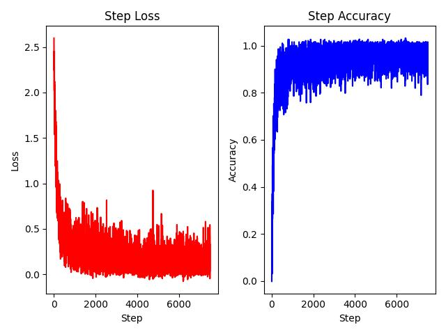

## PyTorch ViT
[](https://github.com/Shubhamai/pytorch-vit/blob/main/LICENSE)

This repo contains my implementation of the ViT paper - *[An image is worth 16x16 words : Transformers for image recognition at scale](https://arxiv.org/abs/2010.11929)* in PyTorch from scratch ( for educational purposes ). Here I am using MNIST as toy dataset so that anyone with low hardware specs can train the transformer in few minutes :) . You can view the specs I used to train this transformer here - [Hardware Requirements](#hardware-requirements)

Since, this project is also highly inspired by the mrdbourke's [paper replication project as part of his pytorch course](https://www.learnpytorch.io/08_pytorch_paper_replicating/), I also have added his dataset to train the model on. 

- [PyTorch ViT](#pytorch-vit)
- [What is ViT ?](#what-is-vit-)
  - [1. Input Embeddings](#1-input-embeddings)
  - [2. Transformer Encoder](#2-transformer-encoder)
  - [3. MLP Head](#3-mlp-head)
- [Setup](#setup)
- [Usage](#usage)
  - [Training](#training)
  - [Testing](#testing)
- [Notes](#notes)
    - [*FAQ 4 myself* :)](#faq-4-myself-)
- [Hardware Requirements](#hardware-requirements)
- [Acknowledgments](#acknowledgments)
- [Citation](#citation)


## What is ViT ?

<p align="center">
<br>
<em>Figure 1. Vision Transformer Architecture</em>
</p>


ViT is a short form of Vision Transformer, a paper introduced by [Dosovitskiy et al.](https://arxiv.org/abs/2010.11929) in 2020. The paper is called ***An Image is Worth 16x16 Words: Transformers for Image Recognition at Scale*** and uses transformers for computer vision tasks like classification. 

Previously, transformers were mostly used in the NLP domain such as text generation - BERT, RoBERTa, XLNet, GPT-2, etc. But due to their powerful attention mechanism, there was a lot of interest in using transforms for computer vision tasks. 


### 1. Input Embeddings
One of the main challenges in using transformers for computer vision is the sheer amount of computational cost needed to directly use image pixels as input embeddings. Instead, we first split the images into multiple patches, and run them through a convolution layer to resize their size to generate the embedding. 

<p align="center">

|   |   | 
|:---:|:---:|
| Original image | Patches |

</center>

The convolution layer also learns through backpropagation to generate meaningful features from the image to be used as embeddings.

After generating the patch embeddings, we add class token and position encoding to the embeddings.
<p align="center">
<br>
<em>Figure 2: Position embeddings of models trained with different hyperparameters.</em>
</p>

### 2. Transformer Encoder

One we have the embedded patches ( see figure 1. ), we then send it through the Transformer Encoder. 
<p align="center">
<br>
<em>Figure 3. Transformer Encoder</em>
</p>

As you can probably see from the image, the transformer encoder does a lot of things, but they are very easy to understand and implement given enough time. I have shared some cool resources in the [Acknowledgments](#acknowledgments) section to help you understand transformer encoder.

These encoder block outputs the same dimension as the input one, so we can easily stack them together capturing more information and better generalization. 

### 3. MLP Head

The MLP head is a fully connected layer that takes the output of the Transformer Encoder and generates the final output. It is simply a combination of a layer normalization and a fully connected layer.

## Setup

1. Clone the repo - `git clone https://github.com/Shubhamai/pytorch-vit/`
2. Create a new conda environment using `conda env create --prefix env python=3.7.13 --file=environment.yml`
3. Activate the conda environment using `conda activate ./env`

## Usage

### Training

You can start the training by running `python train.py`. You can view the default parameters by running `python train.py -h`.

Here what mostly the script does -  
- Downloads the MNIST dataset automatically and save in the [data](/data) directory.
- Training the ViT model on the MNIST train set with parameters passed in the CLI.
- The trainings metrics are saved in the [experiments/results](/experiments/results) directory.
- The model is automatically saved in the [experiments/models/](/experiments/models/) directory.

<p align="center">
<br>
<em>Training Results from 2 epochs on MNIST train set</em>
</p>


### Testing

To test the model, simply run `python test.py` . Yu can view the default parameters by running `python train.py -h`..

Here what mostly the script does -  
- The model will be automatically loaded from [experiments/models/](/experiments/models/) directory.
- Test the model on the MNIST test set with the parameters passed in the CLI.
- The test metrics are saved in the [experiments/results](/experiments/results) directory.

<p align="center">
<br>
<em>Testing Results on MNIST test set</em>
</p>


## Notes

1. The `hidden dim` in [**MLP block**](model/encoder.py)  is calculated by simply multiplying the `input dim` by a **factor of 4**, it is due to a similar pattern observed in Table 1. of the ViT paper. 
2. To `hidden dim` in [**Attention Head**](/model/multi_head_attention.py) for the feed forward layers for query, key and value is calculated by `embed_dim // n_heads` . I am still unsure of why we do it this way.  

#### *FAQ 4 myself* :)  
<details><summary>What's the point of value, key and query in Multi-Head Attention </summary>
[This video](https://youtu.be/H-4bmOxiKyU) from Alex-AI helped me a lot to understand this. 
</details>

<details><summary>Why position embeddings are simply added to the embeddings ?</summary>
I found [this video](https://youtu.be/M2ToEXF6Olw) from AI Coffee Break with Letitia very helpful to understand this. 
</details>

<details><summary>Why is class token added in the embeddings ?</summary>
I find [this answer](https://datascience.stackexchange.com/a/110637) from datascience stackexchange to be the most satisfying answer 
</details>

<details><summary>Why 0th index for the MLP Head input?</summary>
One realization is that the 0th index is actually the class token embedding we concatenated when creating the input embeddings. The question `Why is class token added in the embeddings ?` answers the rest. 
</details> 


## Hardware Requirements

The hardware which I tried the model on default settings is  - 
- Ryzen 5 4600H
- NVIDIA GeForce GTX 1660Ti - 6 GB VRAM
- 12 GB ram

It took around 2 min per epoch on my machine. Since, google colab has similar hardware in terms compute power from what I understand, it should run just fine on colab :)


## Acknowledgments

I found these resources helpful in creating this project:

- [https://www.learnpytorch.io/](https://www.learnpytorch.io/) - a great resource for learning PyTorch, especially for beginners, helped me immensely in understanding ViT and implementing it from scratch. 
- [Transformers from scratch](https://peterbloem.nl/blog/transformers) - a really good blog by peterbloem on understanding the architecture of transformers and implementing it from scratch.
- [ViT-PyTorch](https://github.com/lucidrains/vit-pytorch) - a comparison benchmark to check if the custom ViT was working correctly.
- [Google Python Style Guide](https://google.github.io/styleguide/pyguide.html) - have been following this guide for a while now to write consistent and better python code.
- [Pytorch-Project-Template](https://github.com/moemen95/Pytorch-Project-Template) - for the project template inspiration.
- [Illustrated Transformer](https://jalammar.github.io/illustrated-transformer/) - Understanding transformers in a more visual way by Jay Alammar.
- [e2eml transformers](https://e2eml.school/transformers.html) - A very highly detailed blog on transformers.
- [pytorch-original-transformer](https://github.com/gordicaleksa/pytorch-original-transformer) - Using this as my readme template. 

## Citation

```
@misc{https://doi.org/10.48550/arxiv.2010.11929,
  doi = {10.48550/ARXIV.2010.11929},
  url = {https://arxiv.org/abs/2010.11929},
  author = {Dosovitskiy, Alexey and Beyer, Lucas and Kolesnikov, Alexander and Weissenborn, Dirk and Zhai, Xiaohua and Unterthiner, Thomas and Dehghani, Mostafa and Minderer, Matthias and Heigold, Georg and Gelly, Sylvain and Uszkoreit, Jakob and Houlsby, Neil},
  keywords = {Computer Vision and Pattern Recognition (cs.CV), Artificial Intelligence (cs.AI), Machine Learning (cs.LG), FOS: Computer and information sciences, FOS: Computer and information sciences},
  title = {An Image is Worth 16x16 Words: Transformers for Image Recognition at Scale},
  publisher = {arXiv},
  year = {2020},
  copyright = {arXiv.org perpetual, non-exclusive license}
}
```